# Lab #8 — Infraestructura como Código con Terraform (Azure)

**Curso:** BluePrints / ARSW  
**Equipo:**  
- Laura Alejandra Venegas Pirabán
- Sergio Alejandro Idárraga Torres

**Última actualización:** 2026-03-26

---

## Tabla de Contenidos
- [Descripción General](#descripción-general)
- [Arquitectura Implementada](#arquitectura-implementada)
- [Estructura del Proyecto](#estructura-del-proyecto)
- [Configuración Inicial](#configuración-inicial)
- [Despliegue de Infraestructura](#despliegue-de-infraestructura)
- [CI/CD con GitHub Actions](#cicd-con-github-actions)
- [Validación y Pruebas](#validación-y-pruebas)
- [Diagrama de Arquitectura](#diagrama-de-arquitectura)
- [Reflexión Técnica](#reflexión-técnica)
- [Limpieza de Recursos](#limpieza-de-recursos)

---

## Descripción General

Este laboratorio implementa una arquitectura de alta disponibilidad en Azure utilizando **Infrastructure as Code (IaC)** con Terraform. La solución despliega un balanceador de carga (Layer 4) con múltiples máquinas virtuales Linux ejecutando Nginx, todo gestionado mediante pipelines de CI/CD en GitHub Actions.

### Objetivos Cumplidos
✅ Infraestructura versionada y reproducible con Terraform  
✅ Backend remoto configurado en Azure Storage con state locking  
✅ Alta disponibilidad con Azure Load Balancer y 2 VMs  
✅ Seguridad implementada: NSG, autenticación SSH por clave, tags  
✅ CI/CD automatizado con GitHub Actions y autenticación OIDC  
✅ Health probes y validación de balanceo de carga  

---

## Arquitectura Implementada

### Componentes Principales

<div align="center">
  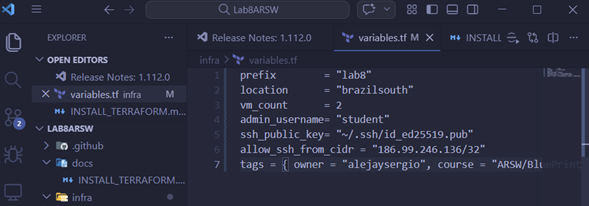
</div>  

- **Resource Group:** `lab8-rg`
- **Virtual Network:** `lab8-vnet` (10.10.0.0/16)
  - **Subnet:** subnet-web (para VMs y Load Balancer)
- **Network Security Group:** 
  - Permite HTTP (80/TCP) desde Internet
  - Permite SSH (22/TCP) solo desde IP específica (186.99.246.136/32)
- **Azure Load Balancer:**
  - IP pública: `20.114.222.55`
  - Backend pool con 2 VMs
  - Health probe en puerto 80
  - Regla de balanceo 80 → 80
- **Virtual Machines:**
  - `lab8-vm-0` y `lab8-vm-1`
  - Ubuntu Linux con Nginx
  - Autenticación SSH por clave pública
- **Azure Storage Account:**
  - Backend remoto para Terraform state
  - Container: `tfstate`
  - State locking habilitado

### Tags Aplicados
```hcl
tags = {
  owner   = "alejaysergio"
  course  = "ARSW/BluePrints"
  env     = "dev"
  expires = "2026-12-31"
}
```

---

## Estructura del Proyecto

```
Lab8ARSW/
├── infra/
│   ├── main.tf              # Recursos principales
│   ├── providers.tf         # Configuración de providers
│   ├── variables.tf         # Variables de entrada
│   ├── outputs.tf           # Outputs del deployment
│   ├── backend.hcl          # Configuración del backend remoto
│   └── env/
│       └── dev.tfvars       # Variables de desarrollo
├── .github/
│   └── workflows/
│       └── terraform.yml    # Pipeline de CI/CD
└── README.md
```

---

## Configuración Inicial

### 1. Bootstrap del Backend Remoto

<div align="center">
  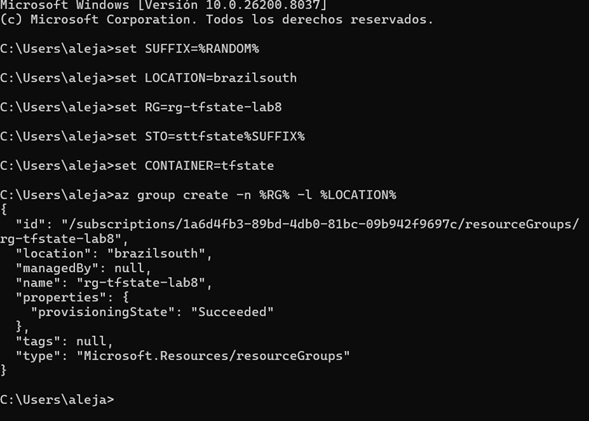
</div>  

```bash
# Configuración de variables
SUFFIX=$RANDOM
LOCATION=brazilsouth
RG=rg-tfstate-lab8
STO=sttfstate${SUFFIX}
CONTAINER=tfstate

# Creación de recursos para el state
az group create -n $RG -l $LOCATION
az storage account create -g $RG -n $STO -l $LOCATION \
  --sku Standard_LRS --encryption-services blob
az storage container create --name $CONTAINER --account-name $STO
```

### 2. Autenticación en Azure

<div align="center">
  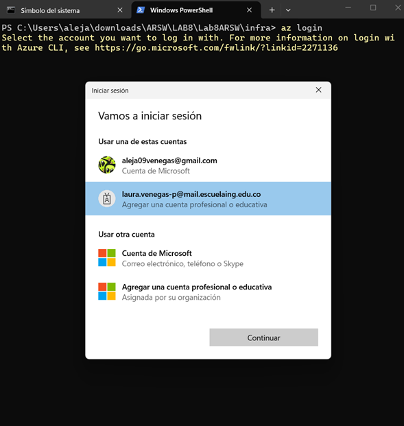
</div>  

<div align="center">
  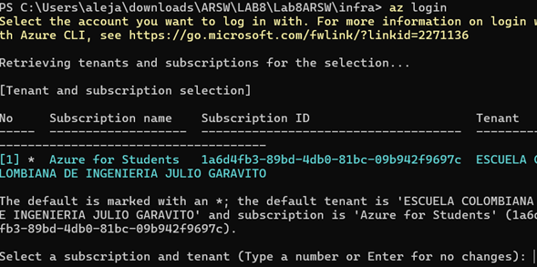
</div>  


```bash
az login
az account show
```

La suscripción utilizada es **Azure for Students** (Escuela Colombiana de Ingeniería Julio Garavito).

### 3. Variables de Configuración

Archivo `infra/env/dev.tfvars`:
```hcl
prefix              = "lab8"
location            = "brazilsouth"
vm_count            = 2
admin_username      = "student"
ssh_public_key      = "~/.ssh/id_ed25519.pub"
allow_ssh_from_cidr = "186.99.246.136/32"
tags = {
  owner   = "alejaysergio"
  course  = "ARSW/BluePrints"
  env     = "dev"
  expires = "2026-12-31"
}
```

---

## Despliegue de Infraestructura

### Inicialización de Terraform

<div align="center">
  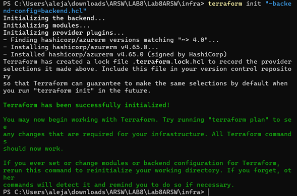
</div>  

<div align="center">
  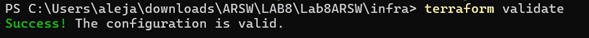
</div>  

```bash
cd infra
terraform init -backend-config=backend.hcl
```

Terraform inicializa correctamente:
- Provider `hashicorp/azurerm` v4.65.0
- Backend remoto configurado
- Lock file `.terraform.lock.hcl` creado

### Validación de Configuración

<div align="center">
  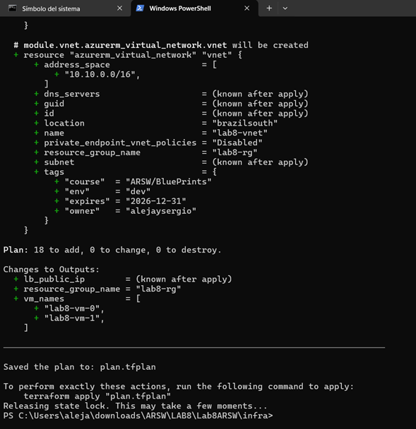
</div>  

```bash
terraform validate
# Success! The configuration is valid.
```

### Plan de Ejecución

<div align="center">
  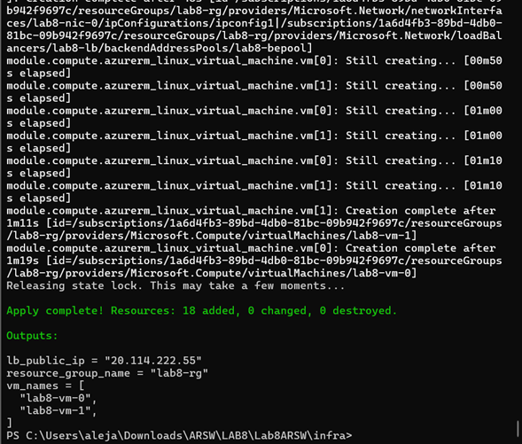
</div>  

```bash
terraform plan -var-file=env/dev.tfvars -out plan.tfplan
```

Plan generado:
- **18 recursos a crear:**
  - Virtual Network
  - Subnet
  - Network Security Group
  - 2 Network Interfaces
  - 2 Virtual Machines
  - Load Balancer (frontend, backend pool, probe, rule)
  - Public IP
  - Storage Account (state)

<div align="center">
  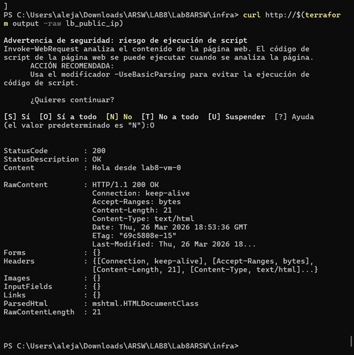
</div>  

### Aplicación de Cambios

```bash
terraform apply "plan.tfplan"
```

**Resultado:**
```
Apply complete! Resources: 18 added, 0 changed, 0 destroyed.

Outputs:
lb_public_ip = "20.114.222.55"
resource_group_name = "lab8-rg"
vm_names = [
  "lab8-vm-0",
  "lab8-vm-1",
]
```

---

## CI/CD con GitHub Actions

### Configuración de OIDC


1. **Creación de App Registration:**
```bash
az ad app create --display-name "lab8-github-actions"
```

2. **Creación de Service Principal:**
```bash
az ad sp create --id <app-id>
```

3. **Configuración de Federated Credentials:**

<div align="center">
  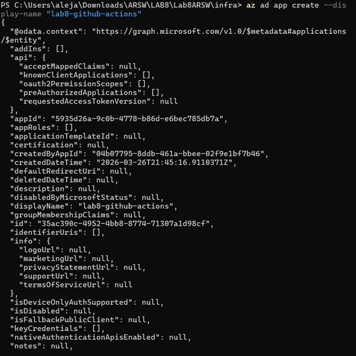
</div>  
```bash
az ad app federated-credential create \
  --id <app-id> \
  --parameters federated.json
```

Configuración en `federated.json`:
```json
{
  "name": "github-actions",
  "issuer": "https://token.actions.githubusercontent.com",
  "subject": "repo:LauraVenegas6/Lab8ARSW:ref:refs/heads/main",
  "audiences": ["api://AzureADTokenExchange"]
}
```

4. **Asignación de Rol:**

<div align="center">
  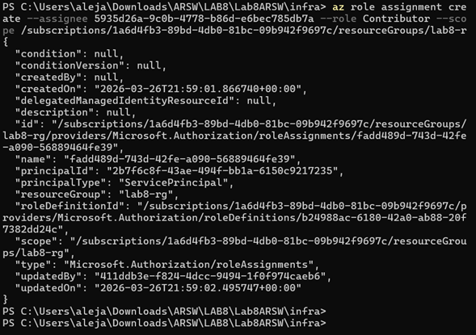
</div>  
```bash
az role assignment create \
  --assignee <service-principal-id> \
  --role Contributor \
  --scope /subscriptions/<subscription-id>/resourceGroups/lab8-rg
```

### Secrets de GitHub

<div align="center">
  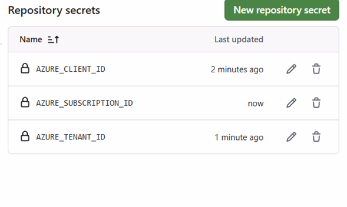
</div>  
Configurados en el repositorio:
- `AZURE_CLIENT_ID`
- `AZURE_SUBSCRIPTION_ID`
- `AZURE_TENANT_ID`

### Workflow de GitHub Actions

<div align="center">
  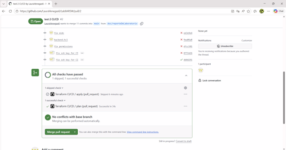
</div>  
El workflow `.github/workflows/terraform.yml` ejecuta:

1. **Plan Job (automático en PR):**
   - Checkout del código
   - Autenticación OIDC con Azure
   - `terraform init`
   - `terraform fmt -check`
   - `terraform validate`
   - `terraform plan`
   - Publicación del plan como artefacto

2. **Apply Job (manual con workflow_dispatch):**
   - Requiere aprobación
   - Ejecuta `terraform apply`
   - Publica outputs

**Estado del workflow:** ✅ All checks have passed

---

## Validación y Pruebas

### Verificación del Load Balancer


```bash
curl http://20.114.222.55
```

**Respuesta:**
```
StatusCode        : 200
StatusDescription : OK
Content           : Hola desde lab8-vm-0
```

Al refrescar múltiples veces, se observa el balanceo entre las dos VMs:
- `Hola desde lab8-vm-0`
- `Hola desde lab8-vm-1`

### Health Probe

El Load Balancer monitorea continuamente el estado de las VMs mediante TCP health probe en puerto 80. Solo las VMs que respondan correctamente reciben tráfico.

### Outputs Esperados

<div align="center">
  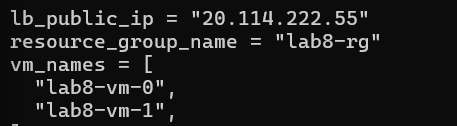
</div>  
```
lb_public_ip = "20.114.222.55"
resource_group_name = "lab8-rg"
vm_names = [
  "lab8-vm-0",
  "lab8-vm-1",
]
```

---

## Diagrama de Arquitectura

<div align="center">
  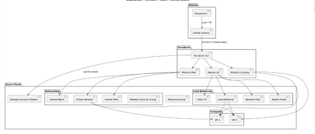
</div>  
El diagrama muestra la arquitectura completa implementada:

### Componentes del Sistema:
1. **Azure Cloud:**
   - Repositorio (Resource Group)
   - Zona de disponibilidad
   - Virtual Network (10.10.0.0/16)

2. **Networking:**
   - Azure Proxy (Load Balancer)
   - Petición C1 y Petición C2 (Health Probes)
   - Network Security Group

3. **Compute:**
   - VM 1 y VM 2 en backend pool
   - Cada VM ejecuta Nginx

4. **Storage:**
   - Storage Account para Terraform state
   - Container `tfstate`

5. **Gestión:**
   - GitHub Actions para CI/CD
   - OIDC authentication

---

## Reflexión Técnica

### Decisiones de Diseño

1. **Layer 4 Load Balancer vs Application Gateway (L7):**
   - **Decisión:** Utilizamos Azure Load Balancer (L4) por simplicidad y costo.
   - **Trade-off:** Application Gateway ofrece características avanzadas como SSL termination, WAF, y path-based routing, pero a mayor costo.
   - **Justificación:** Para este caso de uso (balanceo simple de tráfico HTTP), L4 es suficiente.

2. **Backend Remoto:**
   - **Decisión:** Azure Storage con state locking.
   - **Beneficio:** Permite colaboración en equipo y previene corrupciones del state.
   - **Ubicación:** `brazilsouth` para reducir latencia desde Colombia.

3. **Seguridad:**
   - SSH restringido a IP específica (186.99.246.136/32)
   - Autenticación por clave pública (sin contraseñas)
   - NSG con reglas mínimas necesarias
   - **Mejora sugerida:** Implementar Azure Bastion para eliminar exposición SSH.

4. **CI/CD con OIDC:**
   - **Decisión:** Autenticación sin secretos de larga duración.
   - **Beneficio:** Mayor seguridad, tokens de corta duración.
   - **Complejidad:** Configuración inicial más compleja pero más mantenible.

### Estimación de Costos

**Costos aproximados mensuales (región Brazil South):**

| Recurso | Especificación | Costo Mensual (USD) |
|---------|---------------|---------------------|
| 2x VM Standard_B1s | 1 vCPU, 1 GB RAM | ~$8.50 x 2 = $17 |
| Load Balancer Basic | Gratis hasta 15 GB | $0 |
| Storage Account (LRS) | < 1 GB | $0.02 |
| Public IP (estática) | 1 IP | $3.60 |
| Bandwidth | < 5 GB salida | $0 |
| **TOTAL** | | **~$20.62/mes** |

> **Nota:** Los costos son aproximados y pueden variar. Azure for Students incluye créditos gratuitos.

### Mejoras para Producción

1. **Alta Disponibilidad:**
   - Implementar VM Scale Sets con autoscaling
   - Múltiples zonas de disponibilidad
   - Application Gateway con WAF

2. **Seguridad:**
   - Azure Bastion para acceso SSH
   - Azure Key Vault para gestión de secretos
   - Azure DDoS Protection
   - Implementar HTTPS con certificados SSL

3. **Observabilidad:**
   - Azure Monitor con alertas
   - Application Insights
   - Log Analytics Workspace
   - Budget alerts

4. **Resiliencia:**
   - Azure Backup para VMs
   - Disaster Recovery con Azure Site Recovery
   - Implementar health checks más robustos

5. **Compliance:**
   - Azure Policy para governance
   - Terraform Cloud para state encryption
   - Implementar network isolation completa

### Implicaciones de Seguridad del SSH

**Riesgos de exponer el puerto 22/TCP:**
- Ataques de fuerza bruta
- Escaneo automatizado de vulnerabilidades
- Exposición innecesaria de superficie de ataque

**Mitigaciones implementadas:**
- ✅ Restricción de IP source (186.99.246.136/32)
- ✅ Autenticación solo por clave pública
- ✅ No se utilizan contraseñas

**Mejoras recomendadas:**
- Azure Bastion (acceso SSH sin IP pública)
- Cambio de puerto SSH por defecto
- Implementar 2FA/MFA
- VPN o ExpressRoute para acceso administrativo

---

## Limpieza de Recursos

### Destrucción de Infraestructura

```bash
terraform destroy -var-file=env/dev.tfvars
```

**Importante:**
- Verificar outputs antes de confirmar
- Revisar que todos los 18 recursos serán destruidos
- Confirmar escribiendo `yes`
- Verificar en Azure Portal que los recursos fueron eliminados

### Verificación Post-Destrucción

```bash
az resource list --resource-group lab8-rg
# Debe retornar lista vacía o error de grupo no encontrado
```

---

## Conclusiones

Este laboratorio demuestra exitosamente:

1. ✅ **IaC con Terraform:** Infraestructura completamente versionada y reproducible
2. ✅ **Alta Disponibilidad:** Load Balancer funcionando con 2+ VMs
3. ✅ **Seguridad:** NSG configurado, SSH por clave, principio de mínimo privilegio
4. ✅ **Backend Remoto:** State management con Azure Storage y locking
5. ✅ **CI/CD Moderno:** GitHub Actions con OIDC (sin secretos estáticos)
6. ✅ **Validación Funcional:** Health probes activos y balanceo verificado

### Lecciones Aprendidas

- La configuración inicial de OIDC requiere atención al detalle pero mejora significativamente la seguridad
- El uso de módulos de Terraform facilitaría la reutilización en proyectos futuros
- El remote state es esencial para trabajo colaborativo
- Los tags son cruciales para gestión de costos y governance
- La ubicación geográfica (brazilsouth) afecta costos y latencia

---

## Preguntas de Reflexión

### 1. ¿Por qué L4 LB vs Application Gateway (L7) en tu caso? ¿Qué cambiaría?

**Nuestra elección:** Azure Load Balancer (L4)

**Razones:**
- Simplicidad: balanceo básico de tráfico HTTP
- Costo reducido para el laboratorio
- Suficiente para demostrar alta disponibilidad

**Si cambiaríamos a Application Gateway (L7):**
- Routing basado en URL paths
- SSL/TLS termination centralizado
- Web Application Firewall (WAF)
- Cookie-based session affinity
- Mejor para aplicaciones web complejas

### 2. ¿Qué implicaciones de seguridad tiene exponer 22/TCP? ¿Cómo mitigarlas?

**Implicaciones:**
- Superficie de ataque expuesta a Internet
- Objetivo de bots y scanners automatizados
- Potencial para ataques de fuerza bruta

**Mitigaciones implementadas:**
- Restricción por IP source (/32)
- Solo autenticación por clave SSH
- Contraseñas deshabilitadas

**Mejoras adicionales:**
- Azure Bastion (elimina exposición pública)
- VPN site-to-site
- Port knocking
- fail2ban o sistemas IDS/IPS

### 3. ¿Qué mejoras harías si esto fuera producción?

**Resiliencia:**
- VM Scale Sets con autoscaling
- Availability Zones (múltiples zonas)
- Azure Site Recovery para DR
- Backups automáticos programados

**Seguridad:**
- HTTPS con certificados Let's Encrypt
- Azure Key Vault para secretos
- Azure Bastion obligatorio
- DDoS Protection Standard
- Network isolation completa (subnets segregadas)

**Observabilidad:**
- Azure Monitor con dashboards
- Application Insights
- Log Analytics centralizado
- Alertas proactivas (CPU, memoria, disco)
- Budget alerts configurados

**Governance:**
- Azure Policy para compliance
- Tags obligatorios
- Terraform Cloud/Enterprise para state encryption
- Ambientes separados (dev/staging/prod)
- Approval workflows más estrictos

---

## Referencias

- [Terraform Azure Provider Documentation](https://registry.terraform.io/providers/hashicorp/azurerm/latest/docs)
- [Azure Load Balancer Documentation](https://docs.microsoft.com/en-us/azure/load-balancer/)
- [GitHub Actions OIDC with Azure](https://docs.github.com/en/actions/deployment/security-hardening-your-deployments/configuring-openid-connect-in-azure)
- [Terraform Backend Configuration](https://www.terraform.io/docs/language/settings/backends/azurerm.html)
- [Azure Virtual Network Documentation](https://docs.microsoft.com/en-us/azure/virtual-network/)
- [Terraform Best Practices](https://www.terraform-best-practices.com/)

---

## Contacto

**Repositorio:** [LauraVenegas6/Lab8ARSW](https://github.com/LauraVenegas6/Lab8ARSW)  
**Fecha de entrega:** 2026-03-26  
**Institución:** Escuela Colombiana de Ingeniería Julio Garavito
